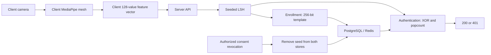

# Architecture and data flow

This is a decomposition of [system.md](../system.md), not a new implementation contract.

## Module boundaries

| Module | Responsibility | Inputs and outputs | Unresolved boundary |
| --- | --- | --- | --- |
| Edge extraction | Capture media, estimate mesh, aggregate enrollment landmarks, derive features. | Local frames -> 128 numerical values. | Landmark mapping, alignment, normalization, quality, liveness, and capture authenticity. |
| API gateway | Validate requests and coordinate enrollment/authentication. | Numerical biometric input -> specified success/mismatch status. | Identity binding, authorization, routes, error semantics, request limits. |
| Cryptography | Seeded LSH projection and XOR/popcount comparison. | Vector + seed -> 256-bit hash; two hashes -> normalized distance. | Projection distribution, deterministic RNG, bit encoding, algorithm version. |
| Inference | Execute the specified CPU ONNX regressor. | Not defined. | Model artifact, input/output shape, training purpose, and place in either feature flow. |
| Storage | Persist and retrieve enrollment material through PostgreSQL/Redis. | Logical user_id/seed/hash tuple. | Schema, cache authority, consistency, lifetimes, backup retention. |
| Compliance | Process authorized revocation and remove matching material. | Revocation event -> seed removal in both stores. | Event contract, authorization, partial failure, concurrency, restore behavior. |

The cryptography module name is inherited from the specification. Similarity hashing alone does not establish encryption or a zero-knowledge proof protocol.

## Specified pipeline

The diagram deliberately does not place ONNX: neither specified feature flow calls it. An inference stage cannot be inserted without clarifying its purpose.

Enrollment uses a new random seed. Authentication must retrieve the matching stored seed before LSH projection. A hash projected under a different seed is not the specified comparison.

## Data lifecycle

| Data | Specified location | Lifecycle information still required |
| --- | --- | --- |
| Frames and facial mesh | Client processing only. | Browser cleanup, telemetry behavior, and local retention policy. |
| 128-value vector | Client, transport, and server processing memory. | Precision, validation, lifetime, and prevention of request-body logging. No vector persistence is specified. |
| 32-byte seed | Server processing and PostgreSQL/Redis. | Access controls, backup copies, rotation/re-enrollment, and deletion completion. |
| 256-bit template | Server processing and PostgreSQL/Redis. | Encoding and whether revocation also removes the template and identity linkage. |
| User identifier | Required by the stored tuple and lookup. | Origin, ownership, tenant scope, and binding to requests. |
| On-chain hash | Mentioned only as a potential immutable anchor. | Whether anchoring is in scope at all. |

## Trust-boundary analysis

The server receives caller-controlled numbers. A valid shape and a close Hamming distance establish similarity to a stored template under the chosen transform; they do not establish when or how the numbers were captured. An exact replay of an accepted vector yields the same hash with the same seed. The specified protocol contains no freshness or trusted-capture proof to distinguish that replay.

The service also receives the biometric vector directly. Consequently, the documented flow does not demonstrate a cryptographic zero-knowledge property. The product must define what information should be hidden, from whom, and against which adversary before that claim can be evaluated.

Revocation crosses two stores and may race with authentication. Deleting a database seed does not by itself remove a cached or already-loaded copy. The completion condition and failure handling must be defined before implementing consent revocation.
